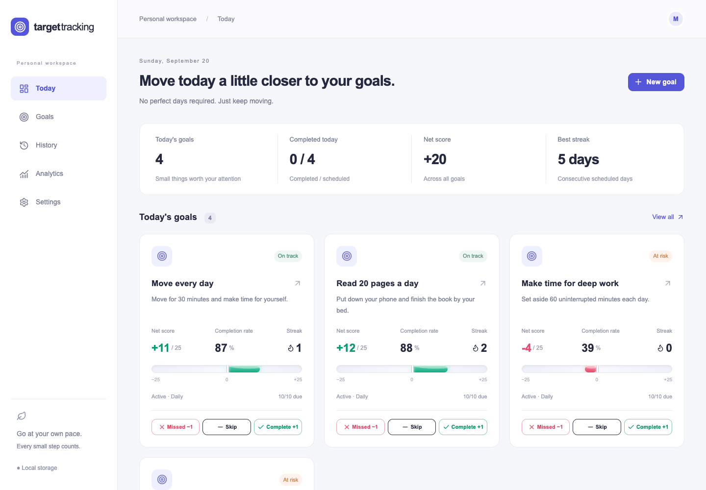
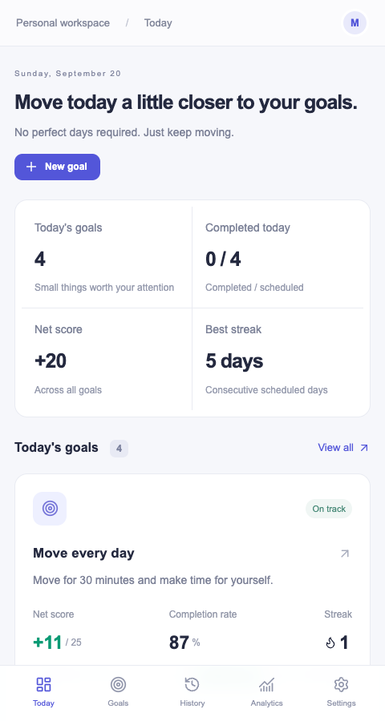
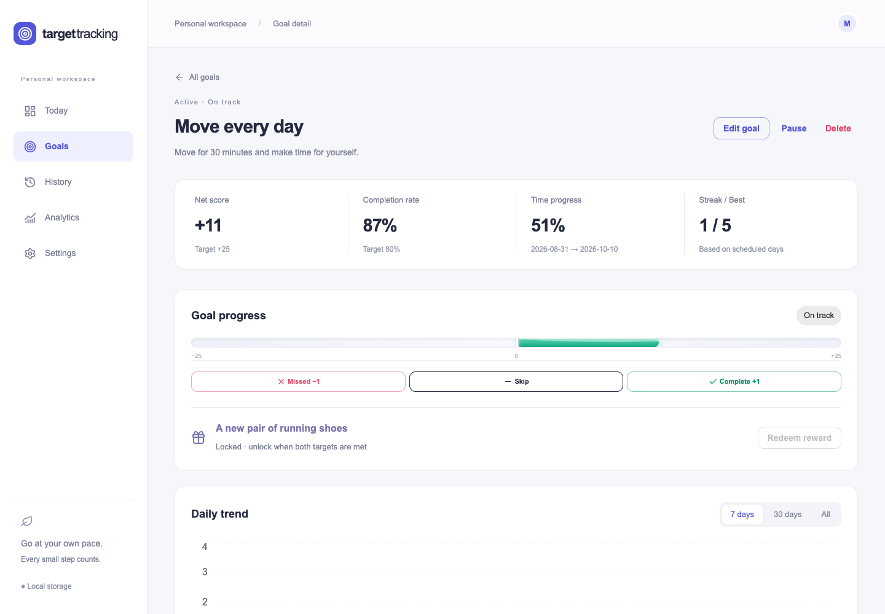
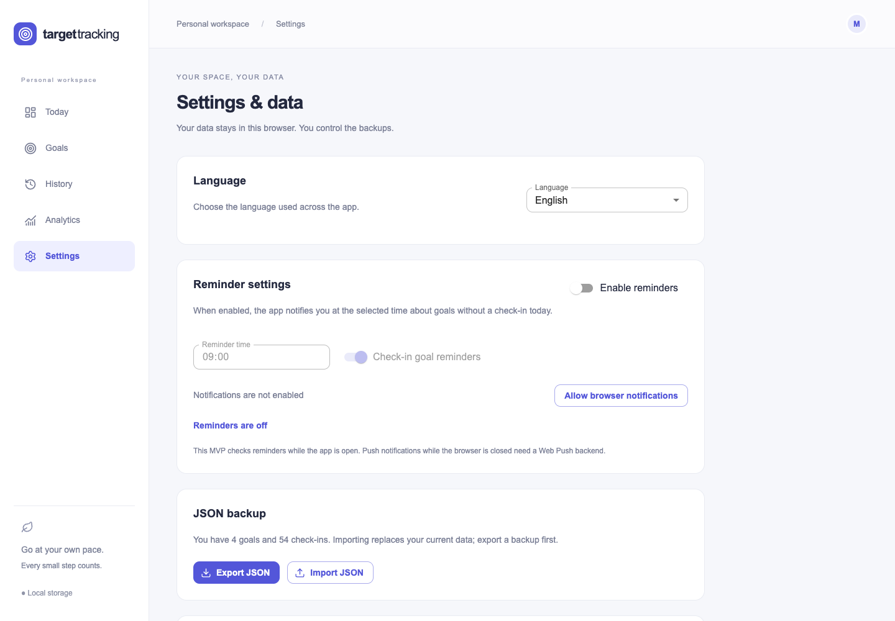

# Target Tracking

[](https://github.com/mkcheung568/target-tracking/actions/workflows/ci.yml)
[](LICENSE)

Target Tracking is a local-first personal goal tracker for turning intentions into daily actions you can record, review, and adjust.

## What is it?

Target Tracking brings goal periods, schedules, daily check-ins, metrics, trends, and rewards into one calm workspace. Create a goal with dates and a frequency, then record each scheduled day as completed, failed, or skipped. The dashboard turns those actions into clear signals: Net Score, Completion Rate, Time Progress, streaks, and health.

## Why does it exist?

Many goals remain as a task-list item or a good intention. The missing piece is often a low-friction daily review:

- A goal needs clear start and end dates, an execution frequency, and measurable success conditions.
- Completed and failed actions need an honest record that does not rely on memory.
- Completion Rate, accumulated score, and elapsed time should remain distinct measurements.
- A day without a record should not silently become a failure.
- Historical data should help users recognize when a goal needs adjustment.

## How it helps

- Turn a vague intention into an actionable goal with dates, frequency, and success conditions.
- Record a scheduled day as completed, failed, or skipped with one click, and revise today's result when needed.
- Compare Net Score and Completion Rate instead of relying on one ambiguous progress number.
- See momentum through Streak, Best Streak, and seven/30-day trends.
- Use Ahead, On Track, Slightly Behind, and At Risk indicators to decide when to adjust.
- Keep motivation and completion history through locked, unlocked, and redeemed reward states.
- Export and import JSON backups while keeping ownership of local data.

## Main views

### Today / Dashboard

See today's scheduled goals, quick check-ins, completion summary, Net Score, Best Streak, and the recent seven-day trend at a glance.



*Desktop Today Dashboard with demo data.*



*Mobile Today view with bottom navigation and demo data.*

### Goals / Goal Detail

Manage goals with create, edit, pause, delete, and lifecycle states. Goal Detail includes an overview, seven/30-day/all-time trends, a simple heatmap, notes, history, and reward status.



*Goal Detail with progress, trends, calendar, and history using demo data.*

### History / Analytics

History provides a desktop table and mobile cards for every check-in. Analytics summarizes completed, failed, and skipped results with seven/30-day trends.

### Settings

Choose Traditional Chinese, Simplified Chinese, or English; export or import JSON; reset demo data; and configure the browser check-in reminder time.



*Settings with language, backup, and reminder controls using demo data.*

## Core rules

- `Completed` adds `+1`, `Failed` subtracts `-1`, and `Skipped` contributes `0`.
- A missing check-in remains `No Record`; it is not silently treated as a failure.
- One goal can have only one check-in per date, while today's result remains editable.
- Completion Rate = completed / (completed + failed); skipped and unrecorded days are excluded.
- Check-ins are the source of truth. Net Score, Completion Rate, Streak, and other metrics are derived at runtime.

## Tech stack

- Next.js App Router + TypeScript
- Tailwind CSS + MUI
- Zustand with `persist` and browser localStorage
- Recharts for trends and summaries
- Framer Motion for the liquid progress animation
- date-fns for date calculations
- Zod + React Hook Form for validation and forms

### Project structure

```text
app/                 App Router pages, layout, global styles
components/          Client UI and shared workspace views
lib/domain.ts        Schemas, check-in rules, metrics, demo data
lib/store.ts         Zustand state, persistence, import/export actions
lib/i18n.ts          Traditional Chinese, Simplified Chinese, English copy
tests/               Domain and behavior tests
docs/screenshots/    README product screenshots
```

## Install and develop

Prerequisites: Node.js 22 LTS or newer and npm. The committed `package-lock.json` makes `npm ci` the recommended reproducible install command.

```bash
git clone https://github.com/mkcheung568/target-tracking.git
cd target-tracking
npm ci
npm run dev
```

Open <http://localhost:3005>. The development script intentionally uses port `3005`.

## Run in production locally

```bash
npm ci
npm run build
PORT=3005 npm run start
```

Next.js serves the production build through its Node server. On a regular Node.js host, use Node.js 22 LTS, HTTPS, and a reverse proxy such as Nginx; set `PORT` to the port provided by the host.

## Docker deployment

The production container listens on port `3005`. It uses Node.js 22 Alpine, a multi-stage build, a non-root user, and a container health check.

### Start the production container

```bash
docker compose up --build -d
```

Open <http://localhost:3005>. Check the container status and logs with:

```bash
docker compose ps
docker compose logs -f target-tracking
```

### Rebuild and restart after updates

After updating the source code, dependencies, or Dockerfile, rebuild the image and recreate the production container from the repository root:

```bash
docker compose up --build --force-recreate -d
docker compose ps
```

After the health check completes, `docker compose ps` should report the container as healthy. Inspect startup logs with:

```bash
docker compose logs -f target-tracking
```

Running `docker compose restart` alone only restarts the existing container. It does not rebuild the image and will not apply source-code or dependency updates.

Stop the container with:

```bash
docker compose down
```

If another project already uses host port `3005`, change only the host port while the container continues to listen on `3005`:

```bash
APP_PORT=3006 docker compose up --build --force-recreate -d
```

Then open <http://localhost:3006>. Keep the same `APP_PORT` value on later rebuilds. Do not run `npm run dev` and the Docker container on the same host port at the same time.

### Docker and local data

Goals, check-ins, language, notification settings, and UI preferences remain in browser localStorage. Rebuilding or restarting the Docker container does not back up or delete this data. The browser can read its existing records after a container restart as long as the same origin is used.

`localhost:3005` and `localhost:3006` are different origins, so they do not share localStorage. Before changing ports, browsers, or devices, export a JSON backup from Settings and import it at the new origin.

## Deploy to Vercel

1. Import this repository into Vercel.
2. Select Next.js as the framework preset.
3. Use `npm ci` for the install command and `npm run build` for the build command.
4. No environment variables are currently required.
5. Open the Vercel URL after deployment completes.

## Data, notifications, and limitations

- Data stays in the current browser's localStorage and is not uploaded automatically.
- Clearing site data, using private browsing, or changing browsers or devices can make existing records unavailable.
- Export JSON regularly. Import replaces the current dataset, so export first.
- The MVP has no backend, database, login, cloud sync, or collaboration.
- Browser reminders are checked while the app is open. True Web Push while the browser is closed requires a backend service.
- Do not place passwords, API keys, or other sensitive information in goal descriptions, notes, or issues.

## Open-source contribution

Read [CONTRIBUTING.md](CONTRIBUTING.md) before opening a pull request. Run lint, type-check, tests, and the production build locally. Feature changes should include relevant domain or UI validation. Use GitHub Issues for bugs and feature ideas.

For security concerns, read [SECURITY.md](SECURITY.md). Community expectations are documented in [CODE_OF_CONDUCT.md](CODE_OF_CONDUCT.md).

## License

This project is released under the [MIT License](LICENSE).
